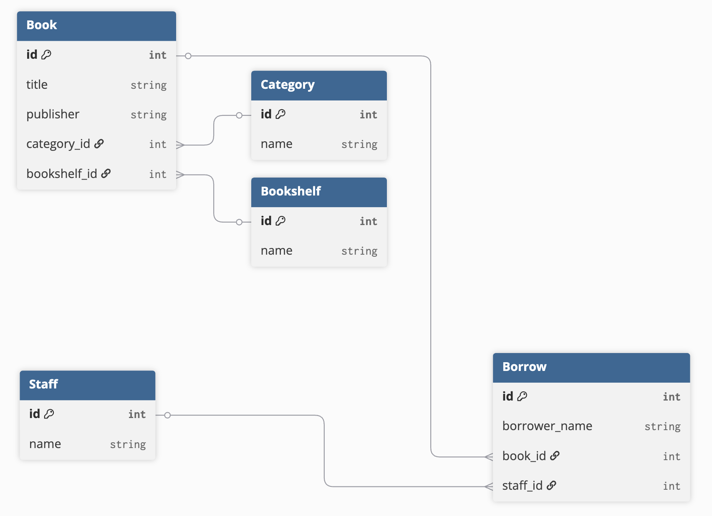
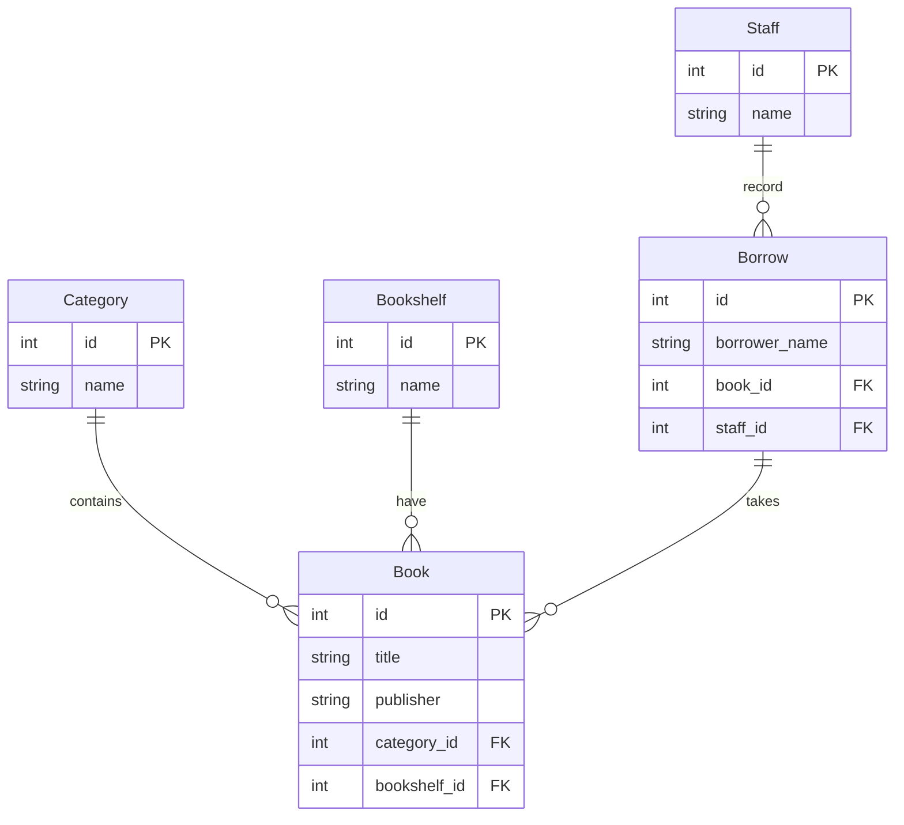
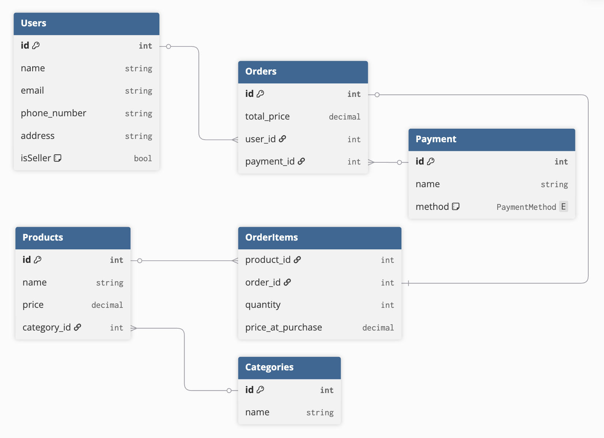
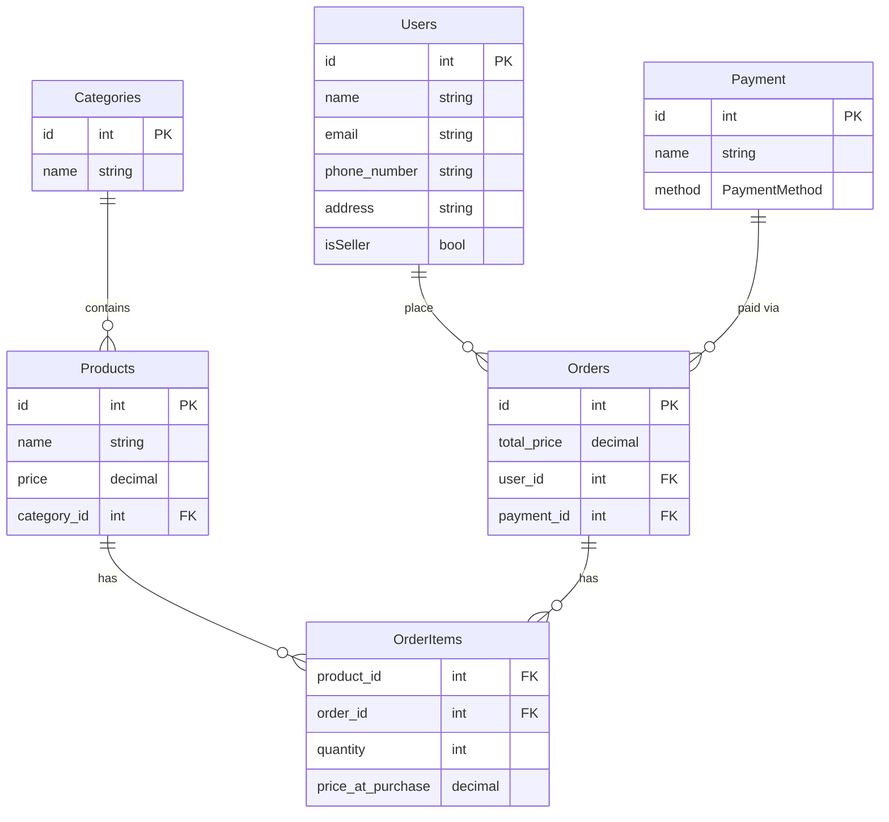

# Minitask 1 - Library
### DB Diagram

```DB Diagram
Table Book {
  id int [pk]
  title string
  publisher string
  category_id int [ref: > Category.id]
  bookshelf_id int [ref: > Bookshelf.id]
}

Table Category {
  id int [pk]
  name string
}

Table Bookshelf {
  id int [pk]
  name string
}

Table Staff {
  id int [pk]
  name string
}

Table Borrow {
  id int [pk]
  borrower_name string
  book_id int [ref: > Book.id]
  staff_id int [ref: > Staff.id]
}
```



# Minitask 2 - E-Commerce
### DB Diagram

```DB Diagram
Table Users {
  id int [pk]
  name string
  email string
  phone_number string
  address string
  isSeller bool [default: false]
}

Table Products {
  id int [pk]
  name string
  price decimal
  category_id int [ref: > Categories.id]
}

Table Categories {
  id int [pk]
  name string
}

Table OrderItems {
  product_id int [ref: > Products.id]
  order_id int [ref: - Orders.id]
  quantity int
  price_at_purchase decimal
}

Table Orders {
  id int [pk]
  total_price decimal
  user_id int [ref: > Users.id]
  payment_id int [ref: > Payment.id]
}

Enum PaymentMethod {
  bank
  wallet
}

Table Payment {
  id int [pk]
  name string
  method PaymentMethod
}
```

